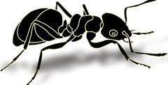

# Welcome to TTS learning

**徐静**

2017年开始关注语音识别(ASR),语音合成(TTS)，最近有时间整理一下TTS的一些经典paper和算法
<!-- 

 -->

### 目录

- [x] 1.语音合成综述
- [x] 2.语音合成开源项目和数据集
- [ ] 3.Text-to-spectrogram
- [ ] 4.End-to-End Models
- [ ] 3.Vocoders
- [ ] 4.语音克隆
- [ ] 5.其他

